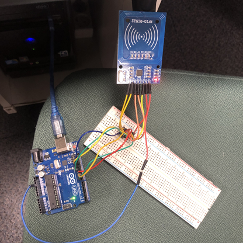
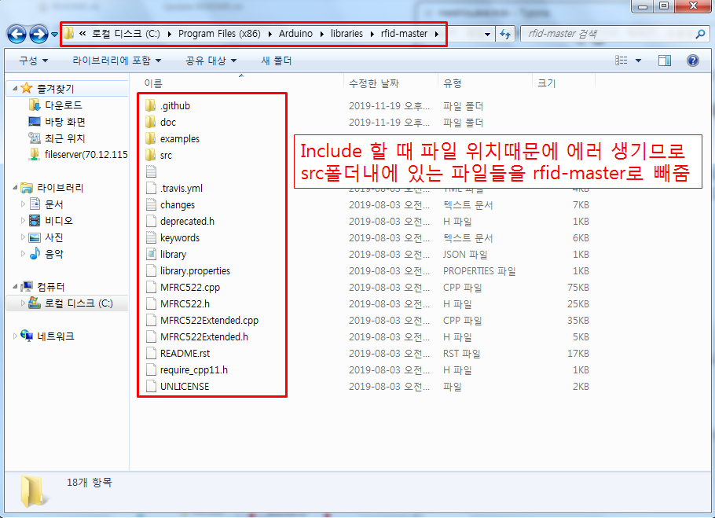
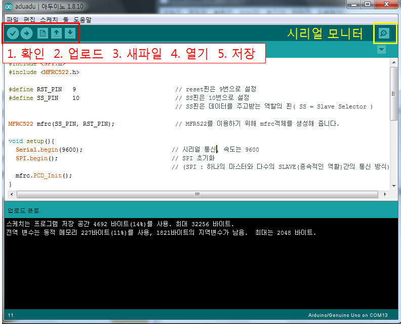
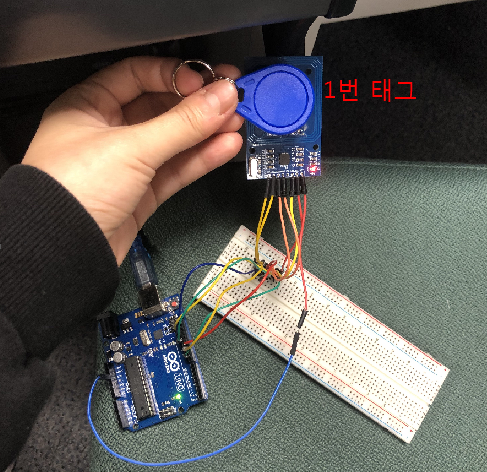
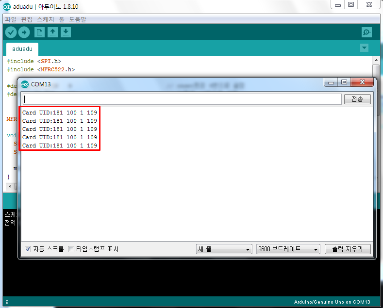
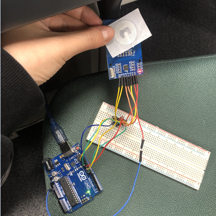
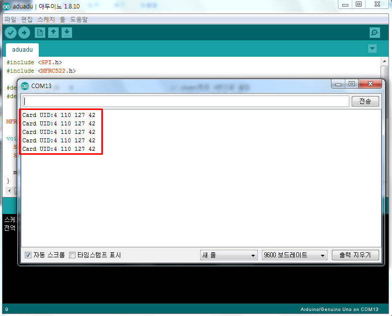

# 1. Arduino IDE 설치 & 세팅

## 1. Arduino IDE 설치

>  https://www.arduino.cc/en/main/software 

<br>

- Windows Installer 로 설치

<br>

<br>

## 2. Arduino 세팅

### 2.0 사전준비

- 준비물 : 아두이노 우노, RFID 카드키, RFID 리더기, 점퍼선, 브레드 보드

<br>

<br>

### 2.1  회로구성

>  https://rasino.tistory.com/221 

- 아두이노와 RFID 리더를 연결해줌

  > 

<br>

<br>

### 2.2 RFID 센서 모듈을 사용하기 위해 라이브러리를 다운로드

>  http://blog.naver.com/PostView.nhn?blogId=eduino&logNo=220957847257&parentCategoryNo=&categoryNo=20&viewDate=&isShowPopularPosts=false&from=postView 

<br>

- RFID 라이브러리 설정

  > https://github.com/miguelbalboa/rfid 

  <br>

  - zip 파일 다운로드 받아서 압축풀고 다음과 같이 arduino 폴더에 넣어주기

    <br>

    > 

<br>

- IDE - 툴 - 라이브러리 관리에서 MFRC522 다운로드

<br>

<br>

### 2.3 태그(Tag) ID 찾기

> 태그는 각자 자신들만의 고유 ID를 가지고 있다. 그러므로 아래 코드를 이용해서 태그의 ID를 먼저 찾도록 한다. 찾아낸 ID는 태그를 식별하는 코드에 쓰기 위해 알아놓자

<br>

- 코드

  ```c
  #include <SPI.h>
  #include <MFRC522.h>
  
  #define RST_PIN   9                            // reset핀은 9번으로 설정
  #define SS_PIN    10                           // SS핀은 10번으로 설정
                                                 // SS핀은 데이터를 주고받는 역할의 핀( SS = Slave Selector )
  
  MFRC522 mfrc(SS_PIN, RST_PIN);                 // MFR522를 이용하기 위해 mfrc객체를 생성해 줍니다.
  
  void setup(){
    Serial.begin(9600);                         // 시리얼 통신, 속도는 9600
    SPI.begin();                                // SPI 초기화
                                                // (SPI : 하나의 마스터와 다수의 SLAVE(종속적인 역활)간의 통신 방식)
    mfrc.PCD_Init();                               
  }
  
  void loop(){
    if ( !mfrc.PICC_IsNewCardPresent() || !mfrc.PICC_ReadCardSerial() ) {   
                                                 // 태그 접촉이 되지 않았을때 또는 ID가 읽혀지지 않았을때
      delay(500);                                // 0.5초 딜레이 
      return;                                    // return
    } 
      
    Serial.print("Card UID:");                  // 태그의 ID출력
    
    for (byte i = 0; i < 4; i++) {               // 태그의 ID출력하는 반복문.태그의 ID사이즈(4)까지
      Serial.print(mfrc.uid.uidByte[i]);        // mfrc.uid.uidByte[0] ~ mfrc.uid.uidByte[3]까지 출력
      Serial.print(" ");                        // id 사이의 간격 출력
    }
    Serial.println(); 
  }
  
  [출처] [아두이노 강좌] RFID를 이용한 태그별 LED 및 Buzzer 제어|작성자 에듀이노 오픈랩
  ```

<br>

- 시리얼 모니터로 태그 ID 확인

  - 코드 입력후 => 확인 => 업로드 => 시리얼모니터

    <br>

    > 

    <br>

  - 파란색 1번 RFID : '181 100 1 109'

    <br>

    > 

    <br>

    > 

  <br>

  <br>

  - 스티커 RFID : '110 127 42'

    >  

    <br>

    > 

<br>

<br>

### 3. 태그 ID를 리더기에 식별하기

>  http://blog.naver.com/PostView.nhn?blogId=eduino&logNo=220957847257&parentCategoryNo=&categoryNo=20&viewDate=&isShowPopularPosts=false&from=postView 

<br>

- 태그 ID를 이용해 식별하는 코드를 입력하고, 태그를 식별해주겠다.

  파란색 태그의 ID를 코드상에 입력하고 아두이노에 업로드 해준다

  - 파란색 태그 인식 : 빨간색 LED 점등, 버저가 한번 `삑` 울림

<br>

- 코드

  ```c
  #include <SPI.h>
  #include <MFRC522.h>
  
  #define RST_PIN   9     // reset핀 설정
  #define SS_PIN    10    // 데이터를 주고받는 역할의 핀( SS = Slave Selector )
  
  MFRC522 mfrc(SS_PIN, RST_PIN);           // 이 코드에서 MFR522를 이용하기 위해 mfrc객체를 생성해 줍니다.
  
  int LED_R = 4;                            // LED를 4번핀에 연결합니다.
  int buzzer = 6;                            // 부저를 6번핀에 연결합니다.
  
  void setup() {
    Serial.begin(9600);                     // 시리얼 통신, 속도는 9600
    SPI.begin();                             // SPI 초기화(SPI : 하나의 마스터와 다수의 SLAVE(종속적인 역활)간의 통신 방식)
  
    pinMode(LED_R, OUTPUT);                 // 4번핀을 출력으로 설정
    pinMode(buzzer, OUTPUT);                 // 6번핀을 출력으로 설정
  }
  
  void loop() {
    if ( ! mfrc.PICC_IsNewCardPresent() || ! mfrc.PICC_ReadCardSerial() ) {    //  태그 접촉이 되지 않았을때 또는 아이디가 읽혀지지 않았을때
      delay(500);       
      return;                                   // return
    }
  
    for (byte i = 0; i < 4; i++) {               // 태그의 ID출력하는 반복문.태그의 ID사이즈(4)까지
    Serial.print(mfrc.uid.uidByte[i]);        // mfrc.uid.uidByte[0] ~ mfrc.uid.uidByte[3]까지 출력
    Serial.print(" ");                        // id 사이의 간격 출력
    }
    Serial.println(); 
      
    if(mfrc.uid.uidByte[0] == 181 && mfrc.uid.uidByte[1] == 100 
         && mfrc.uid.uidByte[2] == 1 && mfrc.uid.uidByte[3] == 109) {    // 2번 태그 ID가 맞을경우
      //digitalWrite(LED_Y, HIGH);                // 3번핀 에 연결된 led 켜지기 
      //digitalWrite(LED_R, LOW);                 // 4번핀 에 연결된 led 꺼지기 
      digitalWrite(LED_R, HIGH);                 // 4번핀 에 연결된 led 켜지기 
      Serial.println("Hello, Eduino~");        // 시리얼 모니터에 "Hello, Eduino~" 출력
      tone(6,523,100);                 
      delay(500);
      
    }else {                                   // 다른 태그 ID일 경우
      //digitalWrite(LED_R, HIGH);              // 3번핀 에 연결된 led 켜지기 
      //digitalWrite(LED_Y, LOW);               // 4번핀 에 연결된 led 꺼지기
      digitalWrite(LED_R, LOW);               // 4번핀 에 연결된 led 꺼지기
      Serial.println("Who are you?");        // 시리얼 모니터에 "Who are you?" 출력 
      tone(6,523,100);                
      delay(300);
      tone(6,523,100);
      delay(500);
    }  
  } 
  ```


<br>


<br>

20191120/ 

## 4. 라즈베리파이 아두이노 연동

test

